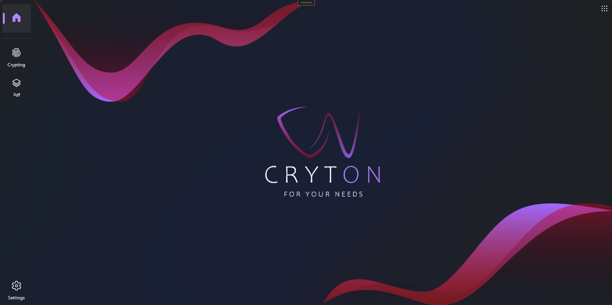
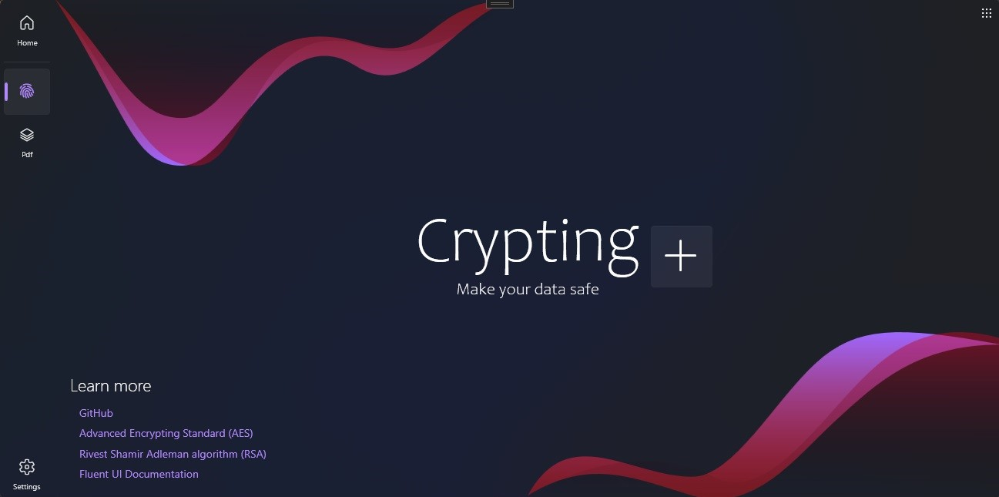
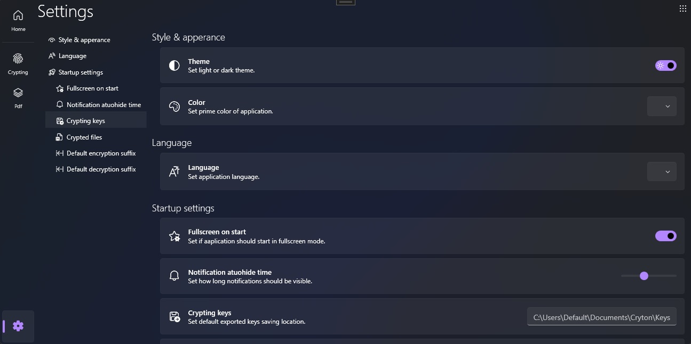
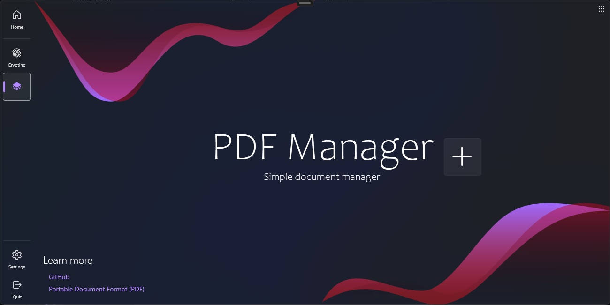

# CrytonCoreNext

WPF program for en/decryption files & PDF manager created with MVVM pattern.

Current implementations:
- AES crypting
- RSA crypting

Upcoming implementations:
- PDF manager
- photo manager
- weather information

Support touch & windows MICA maetrial.

# WPF UI Fluent Modern Design
+ <https://github.com/lepoco/wpfui>
+ <https://wpfui.lepo.co>

## Main page

    

## Crypting page

    

## Settings page

    

## Pdf page

    

